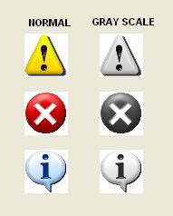



## Icon Gray Render Function

### Description

Draw an Icon in a Gray scale, a nice one!; This simple code demonstrates how you can give a different gray scale to your icons, this is when you need to draw a disabled state or something similar, some other codes, APIS, Functions (small ones) can also give icons the disabled state, but this one looks more attractive in appearance. Take a Look.
 
### More Info
 

             |
---                |---
**Submitted On**   |2005-02-01 12:04:00
**By**             |[MArio Flores G](https://github.com/Planet-Source-Code/PSCIndex/blob/master/ByAuthor/mario-flores-g.md)
**Level**          |Intermediate
**User Rating**    |5.0 (40 globes from 8 users)
**Compatibility**  |VB 4\.0 \(32\-bit\), VB 5\.0, VB 6\.0
**Category**       |[Graphics](https://github.com/Planet-Source-Code/PSCIndex/blob/master/ByCategory/graphics__1-46.md)
**World**          |[Visual Basic](https://github.com/Planet-Source-Code/PSCIndex/blob/master/ByWorld/visual-basic.md)
**Archive File**   |[Icon\_Gray\_184678212005\.zip](https://github.com/Planet-Source-Code/mario-flores-g-icon-gray-render-function__1-58622/archive/master.zip)

